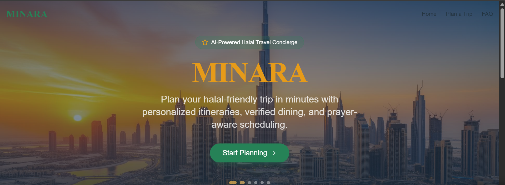
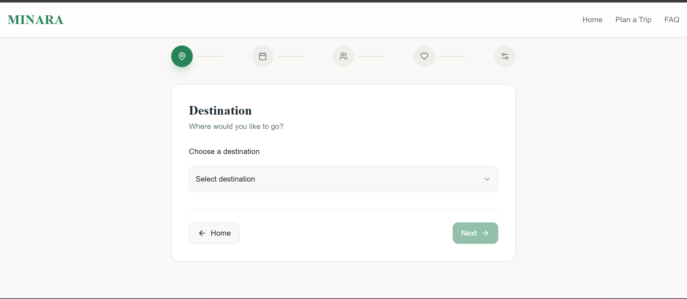
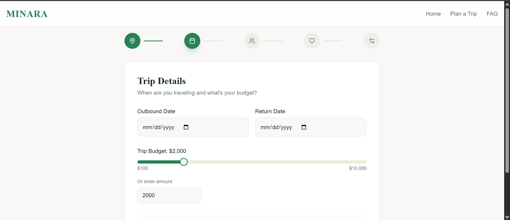
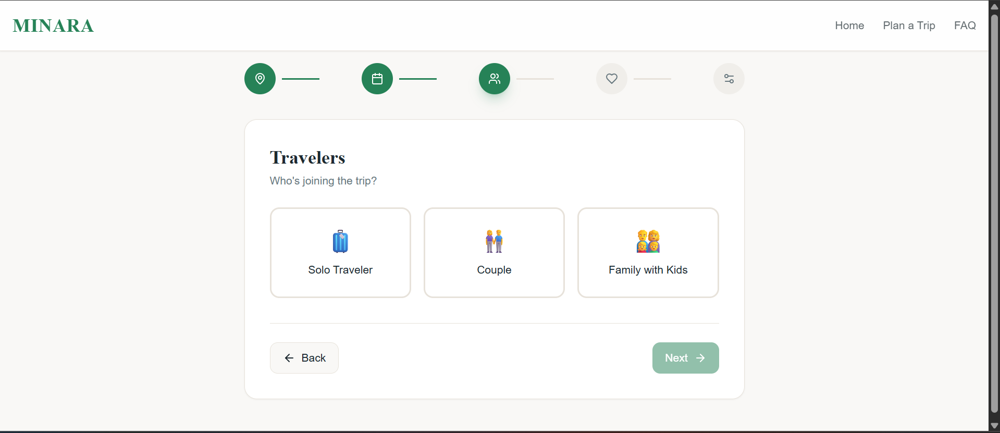
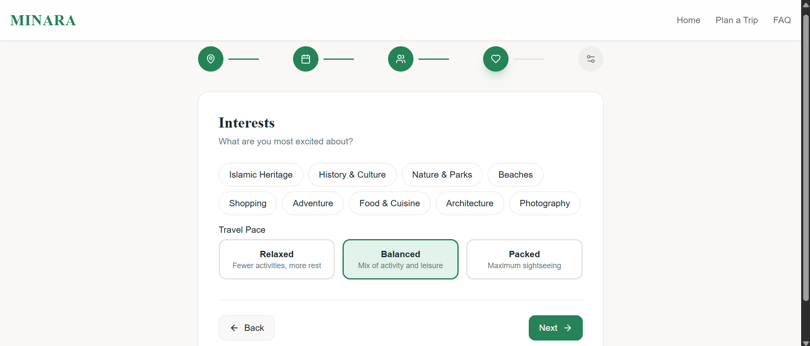
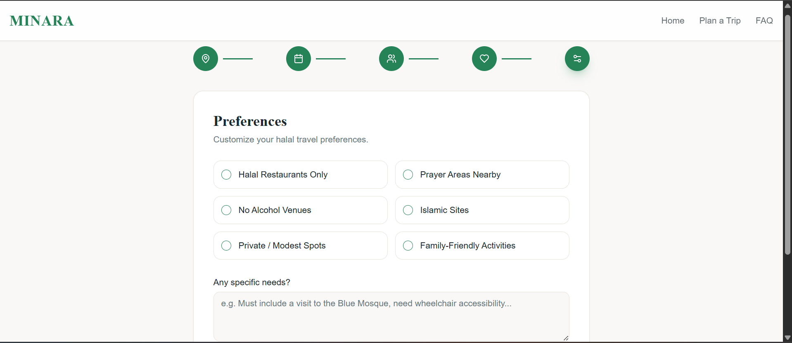
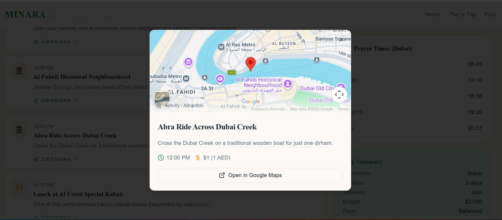

# 🧭 Minara Islamic Itinerary Generator (AI-Powered)

An intelligent travel planning application designed specifically for Muslim travelers. This app uses AI to generate personalized, halal-friendly itineraries based on user preferences, destination, and travel goals—ensuring a smooth and worry-free experience.

---
## 💭Problem Statement
Muslims travelling around the world often face challenges in finding suitable environments, and it is an all-too common occurrence that a Muslim individual or family will visit a destination, only to find that the food, services, or overall setting are not halal or appropriate for their needs.

## 🌍 Overview 
Taking into consideration important things like halal food availability, prayer facilities, and suitable accommodations,  This web app uses AI to help muslims quickly obtain an itinerary that suits their travel needs, preferences, and interests. 

---

## ✨ Features

* 🤖 AI-generated travel itineraries
* 🕌 Prayer-friendly scheduling (includes time for salah)
* 🍽️ Halal restaurant recommendations
* 🏨 Accommodation suggestions aligned with user preferences
* 📍 Google Maps locations for all suggested places
* ⚡ Fast, dynamic itinerary generation
* 🔧 Editable itineraries to suit user preferences
* 💵 Takes into account the user's budget and calculates expected costs for each place

---

## 🚀 Project Info

**Project URL:**
[[https://minaraproto.lovable.app](https://minaraproto.lovable.app)

---
## How to Use the Website
### Home Page

Step 1: Pick your destination.

Step 2: Enter your trip details.

Step 3: Enter your traveler type.

Step 4: Enter your interests.

Step 5: Enter your preferences.
 

Step 6: Wait a little bit, then enjoy your itinerary!

If you click on a place, you can get more information.

## 🧱 Tech Stack

This project is built with:

* **Vite**
* **TypeScript**
* **React**
* **shadcn-ui**
* **Tailwind CSS**

And the help of Lovable AI!

---

## 📌 Vision

This project aims to make travel more accessible and comfortable for Muslims worldwide by combining modern AI capabilities with culturally-aware planning.
